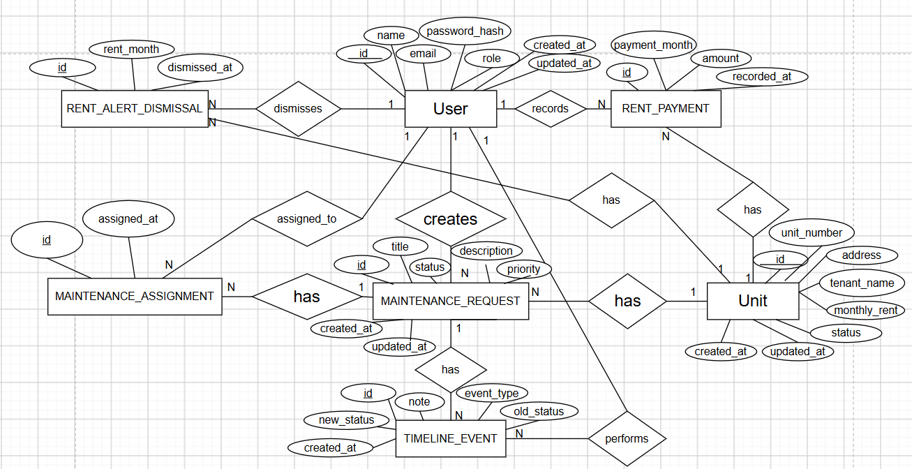

# Schema

## Tables

### users

Stores all users who can access the application. Managers and contractors are
represented using the `role` column rather than separate tables.

| Column | Type | Description |
|---|---|---|
| id | UUID | Primary key |
| name | VARCHAR(100) | User's name |
| email | VARCHAR(255) | Login email; unique |
| password_hash | VARCHAR(255) | Hashed password |
| role | VARCHAR(20) | `MANAGER` or `CONTRACTOR` |
| created_at | TIMESTAMPTZ | Account creation time |
| updated_at | TIMESTAMPTZ | Last update time |

The database enforces unique email addresses and restricts the role to
`MANAGER` or `CONTRACTOR`.

### units

Represents the rental units managed by the application.

| Column | Type | Description |
|---|---|---|
| id | UUID | Primary key |
| unit_number | VARCHAR(50) | Unique unit identifier |
| address | TEXT | Unit address |
| tenant_name | VARCHAR(150) | Current tenant's name |
| monthly_rent | NUMERIC(12,2) | Expected monthly rent |
| status | VARCHAR(20) | `ACTIVE` or `ARCHIVED` |
| created_at | TIMESTAMPTZ | Creation time |
| updated_at | TIMESTAMPTZ | Last update time |

`unit_number` is unique. `monthly_rent` must be greater than zero.

Units are archived instead of deleted so that their related rent and
maintenance history is preserved.

### maintenance_requests

Stores maintenance issues reported for units.

| Column | Type | Description |
|---|---|---|
| id | UUID | Primary key |
| unit_id | UUID | References `units.id` |
| created_by | UUID | References `users.id` |
| title | VARCHAR(200) | Short description of the issue |
| description | TEXT | Detailed description |
| priority | VARCHAR(20) | `LOW`, `MEDIUM`, or `HIGH` |
| status | VARCHAR(20) | Current request status |
| created_at | TIMESTAMPTZ | Creation time |
| updated_at | TIMESTAMPTZ | Last update time |

The supported status values are `REPORTED`, `TRIAGED`, `SCHEDULED`, and
`RESOLVED`.

The supported priority values are `LOW`, `MEDIUM`, and `HIGH`.

Indexes are maintained on `unit_id`, `created_by`, `status`, and `priority`
to support common maintenance queries.

### maintenance_assignments

Associates contractors with maintenance requests.

| Column | Type | Description |
|---|---|---|
| id | UUID | Primary key |
| maintenance_request_id | UUID | References `maintenance_requests.id` |
| contractor_id | UUID | References `users.id` |
| assigned_at | TIMESTAMPTZ | Assignment time |

This is the associative table used to represent the many-to-many relationship
between maintenance requests and contractors.

The combination of `maintenance_request_id` and `contractor_id` is unique, so
the same contractor cannot be assigned to the same request more than once.

### rent_payments

Stores rent recorded against a unit for a particular month.

| Column | Type | Description |
|---|---|---|
| id | UUID | Primary key |
| unit_id | UUID | References `units.id` |
| recorded_by | UUID | References `users.id` |
| payment_month | DATE | Month covered by the payment |
| amount | NUMERIC(12,2) | Amount recorded |
| recorded_at | TIMESTAMPTZ | Time the payment was recorded |

`payment_month` is stored as the first day of the relevant month.

The combination of `unit_id` and `payment_month` is unique, preventing more
than one rent record for the same unit and month.

The payment amount must be zero or greater.

### timeline_events

Stores the history of actions performed on maintenance requests.

| Column | Type | Description |
|---|---|---|
| id | UUID | Primary key |
| maintenance_request_id | UUID | References `maintenance_requests.id` |
| performed_by | UUID | References `users.id` |
| event_type | VARCHAR(40) | Type of timeline event |
| old_status | VARCHAR(20) | Previous status when applicable |
| new_status | VARCHAR(20) | New status when applicable |
| note | TEXT | Optional event note |
| created_at | TIMESTAMPTZ | Event creation time |

Supported event types are:

- `REQUEST_CREATED`
- `STATUS_CHANGED`
- `CONTRACTOR_ASSIGNED`
- `CONTRACTOR_UNASSIGNED`
- `NOTE_ADDED`

Timeline events are append-only at the application level. The application
does not expose update or delete operations for historical events.

### rent_alert_dismissals

Stores a manager's dismissal of an overdue rent alert for a particular unit
and month.

| Column | Type | Description |
|---|---|---|
| id | UUID | Primary key |
| unit_id | UUID | References `units.id` |
| dismissed_by | UUID | References `users.id` |
| rent_month | DATE | Month for which the alert was dismissed |
| dismissed_at | TIMESTAMPTZ | Time of dismissal |

`rent_month` is stored as the first day of the relevant month.

The combination of `unit_id` and `rent_month` is unique, meaning a manager's
dismissal is recorded once for a specific unit and month.

## Relationships

The schema contains the following relationships:

- One `USER` can create many `MAINTENANCE_REQUEST` records.
- One `UNIT` can have many `MAINTENANCE_REQUEST` records.
- One `MAINTENANCE_REQUEST` can have many `MAINTENANCE_ASSIGNMENT` records.
- One `USER` can have many `MAINTENANCE_ASSIGNMENT` records as a contractor.
- One `USER` can record many `RENT_PAYMENT` records.
- One `UNIT` can have many `RENT_PAYMENT` records.
- One `MAINTENANCE_REQUEST` can have many `TIMELINE_EVENT` records.
- One `USER` can perform many `TIMELINE_EVENT` records.
- One `USER` can dismiss many rent alerts.
- One `UNIT` can have many `RENT_ALERT_DISMISSAL` records.

The underlying relationship between maintenance requests and contractors is
many-to-many:

`MAINTENANCE_REQUEST M:N USER (CONTRACTOR)`

It is represented through `maintenance_assignments`. This allows multiple
contractors to be assigned to one request while allowing a contractor to work
on multiple requests.

## Database constraints vs application constraints

The database is responsible for structural integrity and rules that should
always be true regardless of where the data is written.

Database-enforced constraints include:

- Primary keys.
- Foreign keys.
- Required fields using `NOT NULL`.
- Unique user emails.
- Unique unit numbers.
- Unique `(maintenance_request_id, contractor_id)` assignments.
- Unique `(unit_id, payment_month)` rent records.
- Unique `(unit_id, rent_month)` alert dismissals.
- `monthly_rent > 0`.
- `amount >= 0`.
- Allowed values for roles, priorities, statuses, and timeline event types
  using `CHECK` constraints.

Application code handles rules that depend on current business workflow or
authorization.

Examples include:

- Only managers can create, archive, and restore units.
- Only managers can record rent.
- Only managers can assign contractors.
- Contractors can only access requests assigned to them.
- Contractors cannot access rent data.
- Only valid maintenance status transitions are allowed.
- A request cannot move to `SCHEDULED` without a contractor assignment.
- A resolved request can only be reopened into `TRIAGED`.

The boundary is intentional: the database protects structural data integrity,
while the application handles business workflow and authorization rules.

## Deliberate denormalisation

We deliberately keep `tenant_name` directly on the `units` table instead of
creating a separate `tenants` table.

This is a scope-driven simplification. Tenants do not have application
accounts in the required system, and the current requirement only needs the
current tenant's name for a unit.

We also do not store derived values such as rent status or rent alerts as
separate data. They are calculated from the unit's rent, recorded payments,
grace period, and dismissal information.

If the system later needed tenant accounts, tenant history, multiple tenants,
leases, or a tenant portal, this model would need to be expanded.

## What would break first at 100x the data?

The first pressure points would likely be the maintenance request list,
dashboard aggregations, timeline history, and large rent exports.

Maintenance request searches combine text search, filtering, sorting,
pagination, and counting. At much larger volumes, these queries would need
carefully chosen indexes and potentially PostgreSQL full-text or trigram
search.

Dashboard queries could also become expensive because several metrics are
calculated from maintenance, unit, and rent data. We would first optimize the
queries and indexes and only introduce precomputed reporting data if needed.

`timeline_events` will continuously grow because every maintenance request
can generate multiple events. Indexes on the request and timestamp columns
would become increasingly important, and at much larger scale we could
consider partitioning or archiving old history.

Large CSV exports could also become expensive if the entire rent roll had to
be generated synchronously. At that point, an asynchronous export process
would be a reasonable next step.

We are deliberately not introducing Redis, a message broker, or other
infrastructure at this stage because the current scale and requirements do not
justify that complexity.